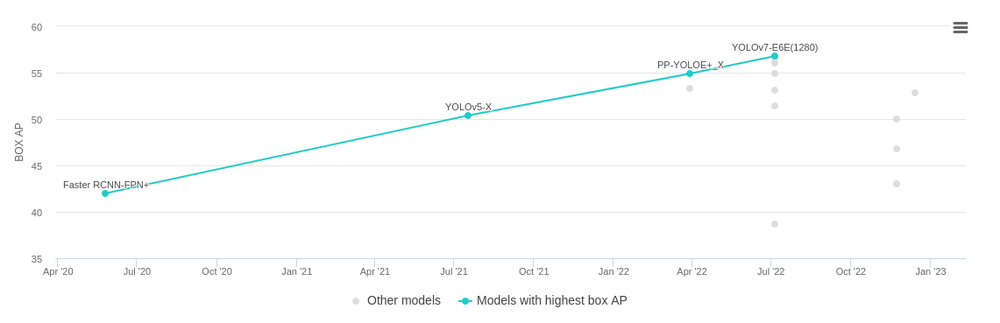
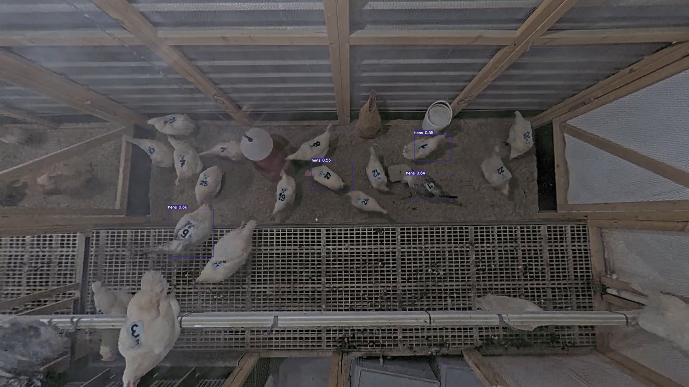

# hens_tracking
To Track the Hens and traceback to egg

**Real-Time Object Detection**
Real-time object detection is the task of doing object detection in real-time with fast inference while maintaining a base level of accuracy.

## Architecture
**YOLOv7**
Official Implementation of **YOLOv7** can be found [here](https://github.com/wongkinyiu/yolov7)

**Why** to choose this Architecture only?

This Architecture is one in leaderboard in [paperwithcode](https://paperswithcode.com/sota/real-time-object-detection-on-coco)

## Dataset
The dataset can be found at [this]() link.
The videos were acquired at the **TBD**

The frames is extracted from the videos using [utils.py](utils.py). 
It was annotated for bounding box using [labelme](https://github.com/wkentaro/labelme). It can be installed as a python package manager [lebelme](https://pypi.org/project/labelme/).
The Annotated images are converted into **YOLO** format using [labelme2yolo.py](labelme2yolo.py).
Dataset is splited into train and val folder which can be found inside [data](data/) folder.

## Running the code
The original YOLOv7 architecture is trained on *COCO* dataset which has *80 class*. So it has modified to train on 1 class to identify **Hens**.
Dataset are placed in data folder in train and val format. 
As we are doing **Transfer Learning**, so pre-trained weights is downloaded [Yolov7.pt](https://github.com/WongKinYiu/yolov7/releases/download/v0.1/yolov7.pt) and placed in the **hens_tracking** folder.

#### Train
Run the [train.py](train.py) script to start the training by passing few arguments
```python
python train.py --workers 1 --device 0 --batch-size 16 --epochs 100 --img 640 640 --hyp data/hyp.scratch.custom.yaml --name yolov7-custom --weights yolov7.pt
```
*Parameter* values can be adjusted according to computing resouces.

#### Testing
Copy the *best.pt* weight file from the **hens_tracking/runs/train/yolov7-custom/weights** and placed in **hens_tracking** folder.
```python
python detect.py --weights best.pt --conf 0.5 --img-size 640 --inference frame9.png --view-img --no-trace
```
#### Output



## To do
* details of the dataset, like from where it got, ...
* 